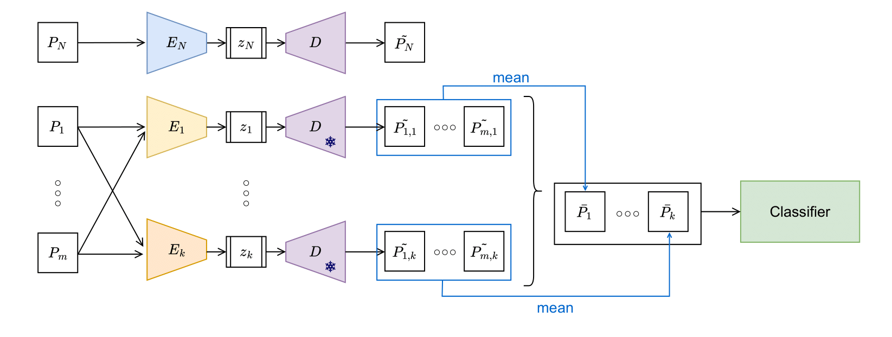

# Tiny_GM_Detectors

This repository contains the implementation of the paper **"Tiny autoencoders are effective few-shot generative model detectors"**, accepted at WIFS 2024.



## Prerequisites

- Python 3.x
- PyTorch
- [Flickr30k Dataset](https://www.kaggle.com/datasets/hsankesara/flickr-image-dataset)

You will need to modify the script paths to point to your local dataset directories.

## Setup

1. Clone the repository:

    git clone /Tiny_GM_Detectors.git
    cd Tiny_GM_Detectors

2. Install the necessary Python packages by running:

    pip install torch torchvision

## Scripts

### 1. Pretrain the Autoencoder

The first step is to pretrain the real autoencoder using the `Flickr30k` dataset. You need to specify the path to the dataset in the script.

    python pretrain_real_ae.py


### 2. Train Tiny Detectors

Once the autoencoder is pretrained, you can train the tiny encoder detectors for the generative models.

    python train_tiny_detectors.py


### 3. Compute Feature Vectors

Compute the feature vectors by extracting the reconstruction errors from the trained encoders.

    python compute_features.py

This generates the feature vectors for model evaluation.


### 4. Model Attribution

Finally, the classifier can be trained, and its performance assessed on the test set. The seeds utilized and the number of images used for training must be specified via the command line.

    python evaluate_model.py -s 41 51 61 71 81 -n 20 rec_errors_path


## Citation

If you use this repository in your research, please cite the following paper:

**"Tiny autoencoders are effective few-shot generative model detectors"**  
*Authors: Luca Bindini, Giulia Bertazzini, Daniele Baracchi, Dasara Shullani, Paolo Frasconi, Alessandro Piva*  
Accepted at WIFS 2024

    ```bibtex
    @inproceedings{bindini2024,
      title={Tiny autoencoders are effective few-shot generative model detectors},
      author={Luca Bindini and Giulia Bertazzini and Daniele Baracchi and Dasara Shullani and Paolo Frasconi and Alessandro Piva},
      booktitle={Proceedings of the 16th IEEE International Workshop on Information Forensics and Security (WIFS)},
      year={2024}
    }
    ```
